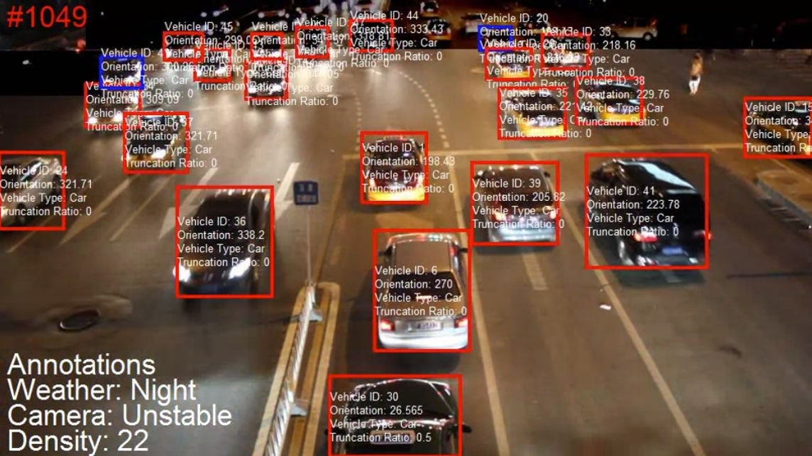

# 1. 多目标跟踪

## 1.1. 论文

## 1.2. 数据集

以下是监控视角下的数<!-- TOC -->

- 1. 多目标跟踪
  - 1.1. 论文
  - 1.2. 数据集
    - 1.2.1. PETS 2009 Benchmark Data
    - 1.2.2. MOT Challenge
      - 1.2.2.1. MOT20
      - 1.2.2.2. MOTS
    - 1.2.3. UA-DETRAC
    - 1.2.4. WILDTRACK
    - 1.2.5. NVIDIA AI CITY Challenge
    - 1.2.6. VisDrone
    - 1.2.7. JTA Dataset
    - 1.2.8. Path Track
    - 1.2.9. KITTI-Tracking
    - 1.2.10. APOLLOSCAPE
      - 1.2.10.1. Dection/Tracking
      - 1.2.10.2. Trajectory
  - 1.3. 指标
  - 1.4. 基准结果

<!-- /TOC -->据集

---

### 1.2.1. PETS 2009 Benchmark Data

该数据集是一个较老的数据集，发布与 2009 年，是包含不同人群活动的多传感器序列，可以用于估计人群人数和密度，跟踪人群中的个人以及检测流量和人群事件。
数据集具体结构如下：

- 校正数据
- S0：训练数据
  - 包含设置背景，市中心，常规流量
- S1：人数和人群密度估计
  - 包含：L1,L2,L3
- S2：人物跟踪
  - 包含：L1,L2,L3
- S3：流分析和事件识别
  - 包含：事件识别和多重流

可用于多目标跟踪的是 S2 部分，从 L1 到 L3，人群密度逐渐增大，困难程度变大。但在处理多个视图的时候，需要用到相机校正数据，将每个人的 2D 边界框投影到其他视图中。
下载地址为[PETS 2009 Benchmark Data](http://www.cvg.reading.ac.uk/PETS2009/a.html)

---

### 1.2.2. MOT Challenge

MOT Challenge 是多目标跟踪方向一个很有影响力的比赛，专注于行人跟踪。其从 2015 年开始提供用于行人跟踪的数据集，至今包含 2D MOT 2015、MOT16、MOT17、MOT20、MOTs。还有用于检测的 MOT17Det 和 MOT20Det，以及用于石斑鱼跟踪的 3D-ZeF20。

#### 1.2.2.1. MOT20

用最新的 MOT20 举例，MOT20 包含 4 组训练用的序列以及 4 组测试用的序列。下载地址为[MOT20](https://motchallenge.net/data/MOT20/)。


MOT 的标签文件分为用于检测的标签和 ground truth 两种，均为 txt 格式存储。首先是用于检测的标签，其标注格式为：
<br>`<frame>, <id>, <bb_left>, <bb_top>, <bb_width>, <bb_height>, <conf>, <x>, <y>, <z>`
<br>例如：<br>

1. 1,-1,757,692,96,209,1,-1,-1,-1
2. 1,-1,667,682,100,222,1,-1,-1,-1
3. 1,-1,343,818,127,258,1,-1,-1,-1

第一个数字是代表帧数；第二个数字-1，意味着没有分配 ID；随后的两个数字分别是 Bbox 的左上角点的坐标；再接着的两个数字是 Bbox 的 w 和 h；后一个数字表示的是置信度；最后三个-1 对检测文件来说没有意义。<br>ground truth 的标注格式为：
<br>`<frame>, <id>, <bb_left>, <bb_top>, <bb_width>, <bb_height>, <0/1>, <cls>, <vis>`
<br>例如：<br>

1. 1,1,199,813,140,268,1,1,0.83643
2. 2,1,201,812,140,268,1,1,0.84015
3. 3,1,203,812,140,268,1,1,0.84015

第一个数字依旧代表着帧数；第二个数字是该 Bbox 的 ID；后面四个数字是 Bbox 的位置以及大小信息，同上；后一个数字表示的也是置信度，0 代表着 ignored，1 代表着 considered；再后一个数字代表着类别；最后一个数字代表着该目标的可视度（遮挡或者处于图像边界会造成目标部分不可见），值的范围是 0~1，

#### 1.2.2.2. MOTS

MOTS 是德国亚琛工业大学计算机视觉实验室在 2019 年发布的提出多目标跟踪与分割的网络 TrackR-CNN 的文章时一同发布的数据集。MOTS 数据集是基于 KITTI_Tracking 和 MOT_Challenge 重新标注的多目标跟踪与分割数据集，是像素级别的数据集。目前只有行人和车辆两个分类。其 GitHub 地址为[mots_tools](https://github.com/VisualComputingInstitute/mots_tools)。下载地址为[MOTS](https://motchallenge.net/data/MOTS/)。
<br>MOTs 数据集提供了 png 和 txt 两种编码格式。两种格式中 id 值为 10000 都表示着忽略区域。
<br>png 格式
<br>png 格式具有 16 位的单颜色通道，可通过以下代码读取：

```
import PIL.Image as Image
img = np.array(Image.open("000005.png"))
obj_ids = np.unique(img)
% to correctly interpret the id of a single object
obj_id = obj_ids[0]
class_id = obj_id // 1000
obj_instance_id = obj_id % 1000
```

或者采用 TensorFlow 时，可以采用如下代码：

```
ann_data = tf.read_file(ann_filename)
ann = tf.image.decode_image(ann_data, dtype=tf.uint16, channels=1)
```

txt 格式
txt 文件中的格式为 time_frame，id，class_id，img_height，img_width，rle，rle 为 COCO 中的编码。<br>例如：<br>1 2029 2 1080 1920 kWn[19ZQ1;I0C>000000000000O13M5K2N00001O001O00001O1O005Df\`b0
<br>这代表着第 1 帧，目标 id 为 2029（分类 id 为 2，即行人；实例 id 为 29），图片大小为 1080\*1920。这种格式的文件也可以采用[cocotools](https://github.com/cocodataset/cocoapi)进行解码。

---

### 1.2.3. UA-DETRAC

UA-DETRAC 是一个车辆多目标检测和跟踪的数据集。数据集包含了在中国北京和天津 24 个不同地点使用 Cannon EOS 550D 摄像机拍摄的 10 个小时的视频。视频以每秒 25 帧（fps）的速度录制，分辨率为 960×540 像素。UA-DETRAC 数据集中有超过 14 万个帧，并且有 8250 辆车进行了手动注释，因此总共有 121 万个带标签的对象边界框。下载地址为[UA-DETRAC](http://detrac-db.rit.albany.edu/download)。数据集结构如下：

- 数据集
  - 训练集图像（5.22GB，60 个序列）
  - 测试集图像（3.94GB，40 个序列）
- 检测
  - 训练集检测（DPM, ACF, R-CNN, CompACT）
  - 测试集检测（DPM, ACF, R-CNN, CompACT）
- 注释
  - DETRAC-Train-Annotations-XML：包含带有属性信息（例如，车辆类别，天气和比例）的完整注释，该注释用于检测训练。
  - DETRAC-Train-Annotations-MAT：包含数据集中忽略背景区域之外的目标轨迹的位置信息，用于检测和跟踪评估。
  - DETRAC-Train-Annotations-XML-v3：包含具有属性信息（例如，车辆类别和颜色，天气和比例）的改进注释，该注释用于检测，跟踪和计数训练。
  - DETRAC-Sequence-Locations：包含每个序列的特定位置信息（24 个不同的位置）。
  - DETRAC-Test-Annotations-XML：包含具有属性信息（例如，车辆类别，天气和比例）的完整注释，该注释用于检测训练。
  - DETRAC-Test-Annotations-MAT：包含目标轨迹在数据集中忽略背景区域之外的位置信息，用于检测和跟踪评估。

其中，DETRAC-Train-Annotations-XML 文件如下：

DETRAC-Train-Annotations-MAT 文件是.mat 格式存储，只包含了目标的边界框。测试集的格式与训练集相同。
<br><br>UA-DETRAC 数据集绘制之后的情况如下：

红色框表示车辆完全可见，蓝色框表示车辆被其他车辆遮挡，粉色矿表示车辆被背景部分遮挡。左下角为该段序列的天气状况、摄像机状态和车辆密度的信息。
<br>[UA-DETRAC](http://detrac-db.rit.albany.edu/download)还提供了数据集的评估工具，有用于评估多目标检测的，也有用于多目标跟踪的。该工具包采用 Matlab 编程，可以用来绘制 PR 曲线。

---

### 1.2.4. WILDTRACK

该数据集采用七个具有重叠视场的高科技静态定位相机获取的，具有高度精确的联合摄像机校准以及视图序列之间的同步。视频的分辨率为 1920×1080 像素，以每秒 60 帧的速度拍摄。
<br>数据集中包含：

1. 以 10 帧/秒，1920×1080 分辨率的帧速率提取的同步帧，并经过后处理来消除失真。
2. 相机模型的校准文件，与 OpenCV 库中提供的投影功能兼容。
3. json 文件格式的地面注释。
4. json 文件格式的 position 文件，方便注重于分类的算法使用。

<br>下载地址在[WILDTRACK](https://www.epfl.ch/labs/cvlab/data/data-wildtrack/)。

---

### 1.2.5. NVIDIA AI CITY Challenge

NVIDIA AI CITY Challenge 是 NVIDIA 公司举办人工智能城市挑战赛，分为四场比赛：运动车辆计数、车辆重识别、多目标车辆跟踪和交通异常检测。每个比赛都提供了专用的数据集，其中可以用于车俩多目标跟踪的是 City-Scale Multi-Camera Vehicle Tracking。
<br>此数据集大小为 15.7 个 GB，包含 215.03 分钟的视频，这些视频是从 46 个摄像机跨越美国中型城市的 16 个交叉路口收集到的。两个最远的同时摄像头之间的距离为 4km。该数据集涵盖了多种位置类型，包括交叉路口，道路延伸和公路。数据集 1/2 为训练集，1/3 为验证集，1/6 是测试集。总体而言，数据集包含了近 38 万个边界框，用于 880 个不同的带注释的车辆标识，并且仅注释了通过至少 2 个摄像机的车辆。每个视频的分辨率至少为 960p，大多数视频的 FPS 为 10。此外，在每种情况下，每个视频都可以使用从开始时间开始的偏移量来同步。
<br>下载地址为[NVIDIA AI CITY Challenge](https://www.aicitychallenge.org/2020-data-and-evaluation/)

---

### 1.2.6. VisDrone

VisoDrone 是一个规模很大的人工智能视觉领域的竞赛，一般其提供的数据集是由无人机拍摄得到。以 VisDrone2020 为例，VisDrone2020 数据集由中国天津大学机器学习和数据挖掘实验室的 AISKYEYE 团队收集，由 265228 帧和包含 10209 静态图像的 400 个视频片段组成，包含 260 万个手动注释的 Bbox。这些视频片段由各种安装在无人机上的摄像机捕获，涵盖范围广泛，比如位置（取自中国数千个相距数千公里的 14 个不同城市）、环境（城市和乡村）、物体（行人、车辆、自行车等）和密度（稀疏和拥挤的场景）。
<br>比赛分为物体检测、单目标跟踪、多目标跟踪和人群计数四个赛道。用于 MOT 的数据集为 96 个视频序列，其中训练集为 56 个序列（24201 帧），验证集为 7 个序列（2819 帧），测试集为 33 个序列（12968 帧）。数据集除了标注了 Bbox 以外，还有提供了遮挡率和截断率。遮挡率为被遮挡的对象比例。截断率则用于指示对象部分出现在图像外部的程度。官方[Github](https://github.com/VisDrone)也提供了许多 VisDrone 的 API。
<br>数据集下载地址为：

- trainset(7.53GB): [百度云](https://pan.baidu.com/s/16BtpKNWi0cEk8WUtfzpEHQ) | [Google Drive](https://drive.google.com/file/d/1-qX2d-P1Xr64ke6nTdlm33om1VxCUTSh/view)
- valset(1.48GB): [百度云](https://pan.baidu.com/s/1wTWFpHw4uLXPVCp1m5fQNQ) | [Google Drive](https://drive.google.com/file/d/1rqnKe9IgU_crMaxRoel9_nuUsMEBBVQu/view?usp=sharing)
- testset-dev(2.14GB): [百度云](https://pan.baidu.com/s/1_gLvMxkMKb3RZjGyZv7btQ) | [Google Drive](https://drive.google.com/open?id=14z8Acxopj1d86-qhsF1NwS4Bv3KYa4Wu)
- testset-challenge(2.7GB): [百度云](https://pan.baidu.com/s/1xIloIRSj1FtcEoWI9esn7w) | [Google Drive](https://drive.google.com/file/d/1I0nn6dVKctzDE5YJ3q9qOlhKLiSIDAxF/view?usp=sharing)

---

### 1.2.7. JTA Dataset

JTA(Joint Track Auto)数据集是通过利用高度写实视频游戏创造的城市环境下的用于行人姿态估计和跟踪的大型数据集。数据集为 512 个 30 秒长的高清视频序列（256 为训练集，256 为测试集），fps 为 30。在 ECCV2018 的论文 Learning to Detect and Track Visible and Occluded Body Joints in a Virtual World 中提出。获取方法在[JTA](https://aimagelab.ing.unimore.it/imagelab/page.asp?IdPage=25)，需要发送邮件获取 JTA-key 才能下载。

数据集分为视频和标注两部分：

- annotations
  - train: 256 个 json 文件
  - test： 128 个 json 文件
  - val： 128 个 json 文件
- videos
  - train： 256 个视频
  - test： 128 个视频
  - val： 128 个视频

注释的 json 文件中包含目标的十个属性：frame number（从 1 开始计数）、person ID、joint type、x2D、y2D、x3D、y3D、z3D、occluded（1 表示被遮挡）、self-occluded（1 表示被遮挡）。其中 2D 坐标是相对于每一帧的左上角计算，3D 坐标则是在标准的相机坐标系中。
<br>提供一个用于解析 JTA 数据集的项目，仓库地址为[JTA_tools](https://github.com/fabbrimatteo/JTA-Dataset)，内有将数据集转化成图像的脚本，也提供了注释可视化的脚本。

---

### 1.2.8. Path Track

Path Track 数据集在 ICCV2017 的论文 PathTrack: Fast Trajectory Annotation with Path Supervision 中被提出，论文中还提出了一个新的框架来队轨迹进行注释。<br>数据集包含 720 个视频序列，有着超过 15000 个人的轨迹。


上图是 Path Track 数据集中的数据统计，图 a 是相机的移动情况，图 b 是场景的分类及统计，图 c 是多方面的数据统计。
<br>Path Track 的下载地址为[Path Track](https://www.trace.ethz.ch/publications/2017/pathtrack/index.html)。

---

以下是驾驶场景下的数据集

---

### 1.2.9. KITTI-Tracking

KITTI 数据集由德国卡尔斯鲁厄理工学院和丰田美国技术研究院联合创办，是目前国际上最大的自动驾驶场景下的计算机视觉算法评测数据集。该数据集用于评测立体图像(stereo)，光流(optical flow)，视觉测距(visual odometry)，3D 物体检测(object detection)和 3D 跟踪(tracking)等计算机视觉技术在车载环境下的性能。KITTI 包含市区、乡村和高速公路等场景采集的真实图像数据，每张图像中最多达 15 辆车和 30 个行人，还有各种程度的遮挡与截断。整个数据集由 389 对立体图像和光流图，39.2km 视觉测距序列以及超过 200000 的 3D 标注物体的图像组成。总体上看，原始数据集被分类为’Road’, ’City’, ’Residential’, ’Campus’ 和 ’Person’。

<br>其中，用于目标跟踪的数据集一共有 50 个视频序列，21 个为训练集，29 个为测试集。下载地址为[KITTI-Tracking](http://www.cvlibs.net/datasets/kitti/eval_tracking.php)，官网上提供了图像、点云等多种形式的数据，还有地图信息和相机信息。

---

### 1.2.10. APOLLOSCAPE

APOLLOSCAPE 是百度公司提供的自动驾驶数据集，包括具有高分辨率图像和每像素标注的 RGB 视频，具有语义分割的测量级密集 3D 点，立体视频和全景图像。数据集分为场景解析、车道分割、轨迹、目标检测/跟踪等等若干个子数据集。可用于多目标跟踪的是下面两个子数据集：

#### 1.2.10.1. Dection/Tracking

检测/跟踪数据集是在各种照明条件和交通密度下于中国北京收集的。更具体地说，它包含了非常复杂的交通流，其中混杂着车辆，骑自行车的人和行人。其中大约 53 分钟的视频序列用于训练，50 分钟的视频序列用于测试。其下载地址为：[APOLLOTracking](http://apolloscape.auto/tracking.html)。数据集文件夹结构如下：

1. train.zip：激光雷达数据采用 PCD（点云数据）格式，bin 文件格式为 2hz。
2. detection/ tracking_train_label.zip：此为标签数据
   - 每个文件都是 1 分钟的序列。
   - 文件中每一行都有 frame_id, object_id, object_type, position_x, position_y, position_z, object_length, object_width, object_height, heading。其中 objec_type 只在跟踪时使用。
   - 给出的位置信息是相对坐标，单位是米。
   - head 值是相对于物体方向的转向弧度。
3. test.zip：测试数据
4. pose.zip：lidar pose，数据格式为：frame*index, lidar_time, position*(x, y, z), quaternion\_(x, y, z ,w)，其中的 position 为绝对位置，在进行跟踪任务时使用。

<br>官网还提供了评估所用的脚本[metric](https://github.com/sibozhang/dataset-api/tree/master/3d_detection_tracking)。

#### 1.2.10.2. Trajectory

## 1.3. 指标

## 1.4. 基准结果
